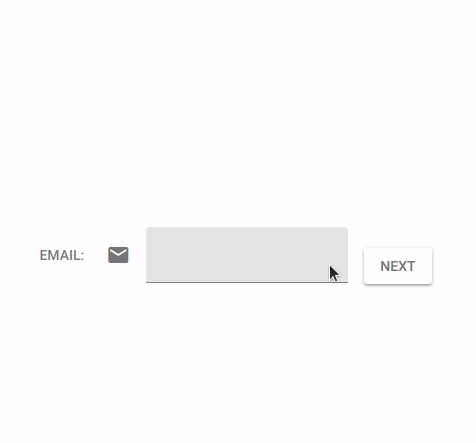

# The Advance Input Component for Quasar@v1

The Advance Input Component for Quasar is used as single-line input box for date, time, password, color, selete etc.



## Usage

Above Quasar@v1.0.0-beta.11.

You should enable these quasar components before used(`quasar.conf.js`):

QBtn, QIcon, QPopupProxy, QCard, QCardSection, QToolbar, QToolbarTitle,
QInput, QSelect, QDate, QTime, QColor

The quasar directive: `close-popup`  and the `vue-i18n` plugin.

There are four internal slots as the same as the `QInput` component:

* `before`
* `prepend`
* `append`
* `after`

There are new two external slots in the `QInputEx` component:

* `top`: the slot on the top of QInput Component
* `bottom`: the slot on the bottom of QInput Component

The `qinputex/dist/` is output for `es2015`, `esm`, `umd`, `cjs`.

`require('qinputex/dist/es2015/')` will register all input types to `QInputEx`

`require('qinputex/dist/es2015/components/qinputex/qinputex')` will only register the basic input types(text, textarea, number) to `QInputEx`.

### Demo

```ts
import { QInputEx } from 'qinputex';
import { Vue, Component, Prop, Mixins, Watch } from 'vue-property-decorator';
import { VNode, CreateElement } from 'vue';

@Component({
  components: {
    QInputEx,
  }
})
export class MyApp extends Vue {
  //<q-input-ex type="color" value="#ff0000"/>
  render(h: CreateElement) {
    return h(QInputEx, {props:{type: 'color', value: '#ff0000'}})
  }
}
```

## Create a new input type

It can register other input types more easy. such as the date type for QDate:

```ts
import { QInputEx, register, InputType } from 'qinputex';

function padStr(value: number, size: number = 2): string {
  var s = String(value);
  while (s.length < size) {s = "0" + s;}
  return s;
}

function getCurrentYM() {
  const vDate = new Date();
  const result = vDate.getFullYear() + '/' + padStr(vDate.getMonth()+1, 2);
  return result;
}

export const DateInput: InputType = {
  name: 'date',
  type: 'text',
  mask: 'date',
  rules: ['date'],
  attaches: {
    'append': {
      icon: 'event',
      popup: {
        name: 'QDate',
        attrs: {
          'default-year-month': getCurrentYM()
        }
      }

    }
  }
}

const PasswordInput = {
  name: 'password',
  type: 'password',
  attaches: {
    'before': {
      icon: 'vpn_key',
    },
    'append': {
      icon: 'visibility',
      click: function() {
        this.isVisiblePwd = !this.isVisiblePwd;
        this.attaches.append.icon = this.isVisiblePwd ? 'visibility_off' : 'visibility';
        this.nativeType = this.isVisiblePwd ? 'text': 'password';
      }
    }
  }
}

register(DateInput);
register(PasswordInput);
```


